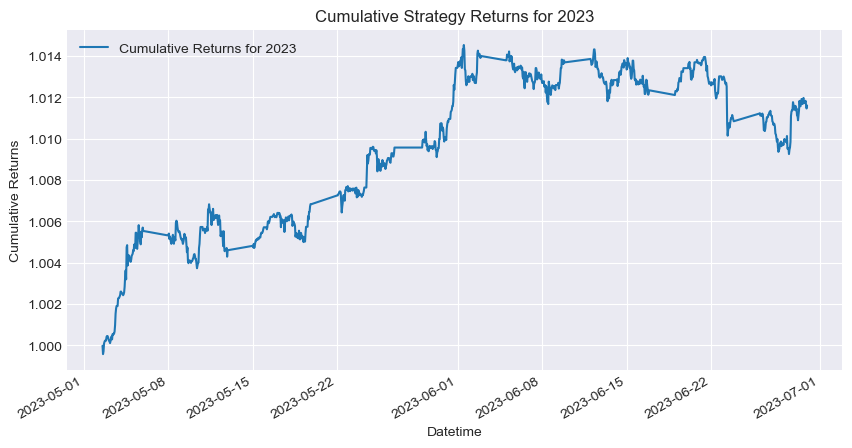

# Project Overview

In the realm of statistical arbitrage trading, mean-reversion trading is a prominent strategy based on the theory that asset prices and returns tend to revert to their long-term average levels. Traders using this strategy identify the normal trading range of an
asset and calculate the mean price using historical data. When prices deviate significantly from this average, they expect a reversal. 

In this project, we will develop a comprehensive algorithmic trading framework for systematic pairs trading, a well-known mean-reversion strategy that exploits temporary price deviations between two co-integrated assets. By connecting theoretical models with practical trading applications, we aim to program and test stochastic price dynamics, providing opportunities to profit from price differences between two underlyig assets.

# Table of Contents
1. [Introduction](#introduction)
2. [Ornstein-Uhlenbeck Process](#ornstein-uhlenbeck)
3. [Data Acquisition and Preprocessing](#data-preprocess)
4. [Price Process Identification](#price-process)
5. [Trading Strategy Framework Development](#trading-strategy)
6. [Mathematical Optimization](#mathematical-optimization) 
7. [Performance Metrics and Backtesting](#testing)
8. [Future Work](#Future) 
9. [Refrences](#Refrences)

## <a id="introduction"></a> Introduction

Mean-reversion strategies like pairs trading are well-established methods used in both retail and institutional trading. Gatev et al. (2006) provided a significant framework for pairs trading, which has influenced subsequent research and practice. Further research has confirmed the profitability of pairs trading in various markets. 

After acquiring market data, we will define the stochastic price dynamics, focusing on the Ornstein-Uhlenbeck process, which is integral to mean-reversion trading. Next, we will examine the diffusion rate and conduct statistical tests to identify the key characteristics of the price series. Our strategy design will include a framework for implementing a systematic trading  along with clearly defined entry and exit rules. 

We will form a spread between two co-moving Forex pairs (EURUSD-CHFUSD) and address the optimal stopping problem by solving the associated differential equation with a free boundary value function to identify the optimal threshold for closing positions. A mathematical solution will then be provided to determine the optimal take-profit price level, with a predefined cut-loss level incorporated to safeguard against unexpected market conditions. To evaluate the strategy, and conducting backtesting and evaluate Performance metrics over the Q2 of 2023 and 2024, where prices are expected to exhibit mean-reversion behavior. 


```python
# Import and filter warnings
import warnings
warnings.filterwarnings("ignore")

## Import Liberaries for this project
import numpy as np
import pandas as pd
import yfinance as yf
import statsmodels.tsa.stattools as ts
import statsmodels.api as sm
import time
import matplotlib.pyplot as plt
plt.style.use('seaborn-v0_8-darkgrid')
from pandas.plotting import register_matplotlib_converters
```

## <a id="ornstein-uhlenbeck"></a> Ornstein-Uhlenbeck Process

The Ornstein-Uhlenbeck model is frequently used to model the price process of assets exhibiting mean-reverting behavior. This model has been applied to various asset classes, including interest rates (Vasicek,1997), currency exchange rates (Larson and Sorensen, 2007), volatility indices (Cassasus and Caliln-Dufresne, 2005), and equities (Gropp, 2004). Mean-reversion strategies like pairs trading and statistical arbitrage take advantage of temporary price deviations from the expected mean. 

The Ornstein-Uhlenbeck process is characterized by being both Gaussian and Markovian. However, its mean-reverting behavior precludes it from being classified as a martingale process. The O-U process is a Gaussian process, meaning that any finite collection of its random variables has a joint Gaussian distribution. 

Mathematically, if \( Z(t) \) denotes the Ornstein-Uhlenbeck process, then for any $ t_1, t_2, \ldots, t_n $, the vector $ (Z(t_1), Z(t_2), \ldots, Z(t_n)) $ is multivariate normal $Z(t) \sim \mathcal{N}(\mu, \Sigma)$.

The process is Markovian, implying that the future state depends only on the present state and not on the past history:
$$
\mathbb{P}(Z(t+s) \leq z \mid Z(t)) = \mathbb{P}(Z(t+s) \leq z \mid Z(t), Z(t-u) \text{ for } u \geq 0)
$$
for $ s \geq 0 $.

The Ornstein-Uhlenbeck process is not a martingale due to its mean-reverting nature. A process $ Z(t) $ is a martingale if:
$$
\mathbb{E}[Z(t+s) \mid \mathcal{F}(t)] = Z(t)
$$
However, for the Ornstein-Uhlenbeck process, it generally satisfies:
$$
\mathbb{E}[Z(t+s) \mid Z(t)] = Z(t) e^{-\lambda s}
$$
which is not equal to $ Z(t) $ for $ s > 0 $.

The stochastic Ornstein-Uhlenbeck process satisfies the stochastic differential equation:
$$
    dZ_t = \theta(\mu - Z_t) \, dt + \sigma \, dW_t
$$
where $\theta$ is the rate of mean reversion, $\mu$ is the long-term mean, and $\sigma$ is the volatility.


The solution to the Ornstein-Uhlenbeck process at time $T$ can be expressed as:
$$
    Z_T = Z_0 e^{-\theta T} + \mu (1 - e^{-\theta T}) + \sigma \int_0^T e^{-\theta (T-t)} \, dW_t
$$

where the $Z_0$ is the initial value of the process.

For the mathematical expectation of the process we have:
$$
    \mathbb{E}[Z_{T}] = Z_{0} e^{-\theta T} + \mu (1 - e^{-\theta T})
$$
For the variance, we have:
$$
    \mathrm{Var}[Z_T] = \sigma^2 \frac{1 - e^{-2\theta T}}{2\theta}
$$
And the process is normally distributed:

  $$
    Z_t \sim \mathcal{N}(\mu, \sigma) \\
    Z_t = \mu + \sigma Z_t  
 $$

where $Z_t \sim \mathcal{N}(0,1)$.


```python
# Parameters for OU Continuous Distribution
Time = 2
M = 10000
dt = 0.01
kappa_dist = 0.7
theta_dist = 0.1
sigma_dist = 0.3
vol0_dist = 0.05  # Initial volatility
Z_dist = np.random.normal(size=M)

def mu(x, dt, kappa, theta):
    ekt = np.exp(-2 * kappa * dt)
    return x * ekt + theta * (1 - ekt)

def std(dt, kappa, sigma):
    e2kt = np.exp(-2 * kappa * dt)
    return sigma * np.sqrt((1 - e2kt) / (2 * kappa))

drift_OU = mu(vol0_dist, Time, kappa_dist, theta_dist)
diffusion_OU = std(dt, kappa_dist, sigma_dist)
vol_OU_dist = drift_OU + diffusion_OU * Z_dist

# Parameters for Monte Carlo Simulation
N = 100  # Number of time steps
M_paths = 25   # Number of simulations
vol0_paths = 0.1  # Initial volatility
kappa_paths = 0.5
theta_paths = 0.2
dt_paths = 0.01
sigma_paths = 0.15

# Initialize arrays
vol_OU_paths = np.full(shape=(N, M_paths), fill_value=vol0_paths)
Z_paths = np.random.normal(size=(N, M_paths))

# Monte Carlo Simulation
start_time = time.time()
for t in range(1, N):
    drift_OU = kappa_paths * (theta_paths - vol_OU_paths[t - 1]) * dt_paths
    diffusion_OU = sigma_paths * np.sqrt(dt_paths)
    vol_OU_paths[t] = vol_OU_paths[t - 1] + drift_OU + diffusion_OU * Z_paths[t]
print('Execution time', time.time() - start_time)

# Plotting both figures side by side
fig, axs = plt.subplots(1, 2, figsize=(14, 5))

# Plot OU Continuous Distribution
axs[0].hist(vol_OU_dist, bins=50, alpha=0.75, color='blue', edgecolor='black')
axs[0].set_title('Ornstein-Uhlenbeck Continuous Distribution at Time')
axs[0].set_xlabel('Volatility')
axs[0].set_ylabel('Frequency')

# Plot Monte Carlo Simulation
for i in range(M_paths):
    axs[1].plot(vol_OU_paths[:, i], alpha=0.75)
axs[1].set_title('Orstein-Uhlenbeck Euler Discretization')
axs[1].set_xlabel('Time Steps')
axs[1].set_ylabel('Volatility')

plt.tight_layout()
plt.show()
```

    Execution time 0.0030028820037841797
    


    

    


Visualizations of the Ornstein-Uhlenbeck (OU) process: the histogram showing the continuous distribution of volatility at a given time and the Monte Carlo simulation of OU price paths using Euler discretization

## <a id="data-preprocess"></a> Data Acquisition and Preprocessing

We choose EUR/USD and CHF/USD for our quantitative research due to the strong economic integration between Switzerland and the Eurozone, which causes similar movements in these currency pairs. Both the European Central Bank (ECB) and the Swiss National Bank (SNB) often follow similar monetary policies, further linking the EUR and CHF. Seasonal economic trends in the second quarter, influenced by Q1 data releases, provide clearer outlooks, impacting central bank policies and investor sentiment, enhancing the alignment between these currencies.

Focusing on the second quarter is strategic due to seasonal increases in trade volumes and portfolio adjustments by institutional investors, leading to tighter correlations between EUR/USD and CHF/USD. March is a key month for US financial decisions, with significant announcements from the Federal Reserve and the US government influencing the USD, EUR/USD, and CHF/USD. This period often sees higher cointegration, making it ideal for mean-reversion strategies. Historical patterns show that arbitrage opportunities based on cointegration perform better during this period of macroeconomic alignment.


```python
# Define years and date ranges
years = [2023, 2024]
start_date = '-04-01'
end_date = '-06-30'

# Dictionary to store dataframes for each year
yearly_data = {}

# Loop through each year to fetch data directly for the date range
for year in years:
    # Fetch historical data for EURUSD and CHFUSD
    eu_data = yf.download('EURUSD=X', start=f'{year}{start_date}', end=f'{year}{end_date}',interval='1h')
    chf_data = yf.download('CHFUSD=X', start=f'{year}{start_date}', end=f'{year}{end_date}',interval='1h')

    # Ensure data is fetched
    if eu_data.empty or chf_data.empty:
        raise Exception(f'Failed to download data for year {year} from one or both tickers.')

    # Combine data
    df = pd.DataFrame({'EURUSD': eu_data['Close'], 'CHFUSD': chf_data['Close']})

    # Store the filtered data
    yearly_data[year] = df

    # Save the data to CSV
    df.to_csv(f'data_{year}.csv', index=True)

    print(f"Data for {year} saved to 'data_{year}.csv'.")

# Create a 2x2 grid of subplots for each year
fig, axes = plt.subplots(2, 1, figsize=(14, 10))

# Flatten the 2x2 axes array for easier iteration
axes = axes.flatten()

# Plot data for each year in the corresponding subplot
for i, (year, data) in enumerate(yearly_data.items()):
    ax = axes[i]
    ax.plot(data['EURUSD'], label=f'EURUSD {year}')
    ax.plot(data['CHFUSD'], label=f'CHFUSD {year}')
    ax.set_title(f"EURUSD and CHFUSD Closing Prices for {year} (March 1 to July 31)")
    ax.set_xlabel("Date")
    ax.set_ylabel("Price")
    ax.legend()

# Adjust layout for better spacing
plt.tight_layout()
plt.show()
```

    [*********************100%%**********************]  1 of 1 completed
    [*********************100%%**********************]  1 of 1 completed
    [*********************100%%**********************]  1 of 1 completed

    Data for 2023 saved to 'data_2023.csv'.
    

    
    [*********************100%%**********************]  1 of 1 completed
    

    Data for 2024 saved to 'data_2024.csv'.
    


    

    


```python
df_2023 = pd.read_csv('data_2023.csv', index_col=0, parse_dates=True)
df_2024 = pd.read_csv('data_2024.csv', index_col=0, parse_dates=True)
print(df_2023.info)
print(df_2024.info)
```

    <bound method DataFrame.info of                              EURUSD    CHFUSD
    Datetime                                     
    2023-04-03 00:00:00+01:00  1.080614  1.089645
    2023-04-03 01:00:00+01:00  1.081783  1.090739
    2023-04-03 02:00:00+01:00  1.081198  1.090750
    2023-04-03 03:00:00+01:00  1.079797  1.089491
    2023-04-03 04:00:00+01:00  1.079331  1.089384
    ...                             ...       ...
    2023-06-29 19:00:00+01:00  1.086957  1.111395
    2023-06-29 20:00:00+01:00  1.087193  1.111506
    2023-06-29 21:00:00+01:00  1.086957  1.112013
    2023-06-29 22:00:00+01:00  1.086720  1.112310
    2023-06-29 23:00:00+01:00  1.086838  1.111889
    
    [1524 rows x 2 columns]>
    <bound method DataFrame.info of                              EURUSD    CHFUSD
    Datetime                                     
    2024-04-01 00:00:00+01:00  1.079564  1.108684
    2024-04-01 01:00:00+01:00  1.079331  1.108807
    2024-04-01 02:00:00+01:00  1.078981  1.108402
    2024-04-01 03:00:00+01:00  1.079098  1.108709
    2024-04-01 04:00:00+01:00  1.079331  1.109152
    ...                             ...       ...
    2024-06-28 18:00:00+01:00  1.071697  1.113201
    2024-06-28 19:00:00+01:00  1.071467  1.112941
    2024-06-28 20:00:00+01:00  1.071237  1.113251
    2024-06-28 21:00:00+01:00  1.071697  1.112916
    2024-06-28 22:00:00+01:00  1.071582       NaN
    
    [1547 rows x 2 columns]>
    

To prevent look-ahead bias, we split the data into in-sample (April) for model training and out-sample (May–June) for validation. This ensures the model is tested only on data available at the time, simulating real-world trading conditions and avoiding any future information from influencing decisions.

We sliced the Q2 data using Pandas Timestamps, isolating the in-sample and out-sample periods for proper backtesting. This ensures the model is trained on past data and evaluated on unseen future data.


```python
# Convert string datetimes to Pandas Timestamps
start_in_sample = pd.Timestamp('2023-04-01 00:00:00+00:00')
end_in_sample = pd.Timestamp('2023-04-30 23:59:59+00:00')
start_out_sample = pd.Timestamp('2023-05-01 00:00:00+00:00')
end_out_sample = pd.Timestamp('2023-06-30 23:59:59+00:00')

# Slice the DataFrame using Timestamps
in_sample_2023 = df_2023.loc[start_in_sample:end_in_sample]
out_sample_2023 = df_2023.loc[start_out_sample:end_out_sample]
```


```python
# Convert string datetimes to Pandas Timestamps
start_in_sample = pd.Timestamp('2024-04-01 00:00:00+00:00')
end_in_sample = pd.Timestamp('2024-04-30 23:59:59+00:00')
start_out_sample = pd.Timestamp('2024-05-01 00:00:00+00:00')
end_out_sample = pd.Timestamp('2024-06-30 23:59:59+00:00')

# Slice the DataFrame using Timestamps
in_sample_2024 = df_2024.loc[start_in_sample:end_in_sample]
out_sample_2024 = df_2024.loc[start_out_sample:end_out_sample]
```


```python
# Cheching the data  
def check_na_and_info(df, df_name):
    
    print(f"\n{df_name} Information:")
    df.info()

    # Check and print the count of missing (NaN) values for each column
    print(f"\n{df_name} Missing Values (NaN) Count:")
    print(df.isna().sum())
    
# Check for missing values in each DataFrame
check_na_and_info(in_sample_2023, 'In_sample_2023')
check_na_and_info(out_sample_2023, 'Out_sample_2023')
check_na_and_info(in_sample_2024, 'In_sample_2024')
check_na_and_info(out_sample_2024, 'Out_sample_2024')

# Function to calculate and print duplicates count and proportion
def print_duplicate_info(df, df_name):
    # Display the count of duplicate values
    duplicate_count = df.duplicated().value_counts()

    # Print the count of duplicates and proportion of duplicates if available
    print(f"\n{df_name} Duplicates Count:")
    print(duplicate_count)

    # Safely access the count of True (duplicates)
    if 1 in duplicate_count:
        proportion = round(duplicate_count[1] / df.shape[0], 4)
        print(f'Proportion of duplicate values in {df_name} is {proportion}.')
    else:
        print(f'No duplicate values found in {df_name}.')
        
# Call the function for each DataFrame
print_duplicate_info(in_sample_2023, 'In_sample_2023')
print_duplicate_info(out_sample_2023, 'Out_sample_2023')
print_duplicate_info(in_sample_2024, 'In_sample_2024')
print_duplicate_info(out_sample_2024, 'Out_sample_2024')
```

    
    In_sample_2023 Information:
    <class 'pandas.core.frame.DataFrame'>
    DatetimeIndex: 477 entries, 2023-04-03 00:00:00+01:00 to 2023-05-01 00:00:00+01:00
    Data columns (total 2 columns):
     #   Column  Non-Null Count  Dtype  
    ---  ------  --------------  -----  
     0   EURUSD  477 non-null    float64
     1   CHFUSD  474 non-null    float64
    dtypes: float64(2)
    memory usage: 11.2 KB
    
    In_sample_2023 Missing Values (NaN) Count:
    EURUSD    0
    CHFUSD    3
    dtype: int64
    
    Out_sample_2023 Information:
    <class 'pandas.core.frame.DataFrame'>
    DatetimeIndex: 1047 entries, 2023-05-01 01:00:00+01:00 to 2023-06-29 23:00:00+01:00
    Data columns (total 2 columns):
     #   Column  Non-Null Count  Dtype  
    ---  ------  --------------  -----  
     0   EURUSD  1047 non-null   float64
     1   CHFUSD  1042 non-null   float64
    dtypes: float64(2)
    memory usage: 24.5 KB
    
    Out_sample_2023 Missing Values (NaN) Count:
    EURUSD    0
    CHFUSD    5
    dtype: int64
    
    In_sample_2024 Information:
    <class 'pandas.core.frame.DataFrame'>
    DatetimeIndex: 524 entries, 2024-04-01 01:00:00+01:00 to 2024-05-01 00:00:00+01:00
    Data columns (total 2 columns):
     #   Column  Non-Null Count  Dtype  
    ---  ------  --------------  -----  
     0   EURUSD  524 non-null    float64
     1   CHFUSD  524 non-null    float64
    dtypes: float64(2)
    memory usage: 12.3 KB
    
    In_sample_2024 Missing Values (NaN) Count:
    EURUSD    0
    CHFUSD    0
    dtype: int64
    
    Out_sample_2024 Information:
    <class 'pandas.core.frame.DataFrame'>
    DatetimeIndex: 1022 entries, 2024-05-01 01:00:00+01:00 to 2024-06-28 22:00:00+01:00
    Data columns (total 2 columns):
     #   Column  Non-Null Count  Dtype  
    ---  ------  --------------  -----  
     0   EURUSD  1022 non-null   float64
     1   CHFUSD  1020 non-null   float64
    dtypes: float64(2)
    memory usage: 24.0 KB
    
    Out_sample_2024 Missing Values (NaN) Count:
    EURUSD    0
    CHFUSD    2
    dtype: int64
    
    In_sample_2023 Duplicates Count:
    False    474
    True       3
    Name: count, dtype: int64
    No duplicate values found in In_sample_2023.
    
    Out_sample_2023 Duplicates Count:
    False    1043
    True        4
    Name: count, dtype: int64
    No duplicate values found in Out_sample_2023.
    
    In_sample_2024 Duplicates Count:
    False    519
    True       5
    Name: count, dtype: int64
    No duplicate values found in In_sample_2024.
    
    Out_sample_2024 Duplicates Count:
    False    1016
    True        6
    Name: count, dtype: int64
    No duplicate values found in Out_sample_2024.
    


```python
# Cleaning the data and dorping NAN
in_sample_2023 = in_sample_2023.dropna(subset=['CHFUSD'])
out_sample_2023 = out_sample_2023.dropna(subset=['CHFUSD'])
in_sample_2024 = in_sample_2024.dropna(subset=['CHFUSD'])
out_sample_2024 = out_sample_2024.dropna(subset=['CHFUSD'])
```

## <a id="price-process"></a> Price Process Identification

To identify a mean-reverting price series, start by finding a range-bound market where prices consistently return to their long-term average. Note that short-term mean-reverting behavior may occur without long-term stability, potentially shifting to a trending market. Therefore, consider the diffusion speed to assess if a financial instrument is suitable for a mean-reverting strategy.

A mean-reverting time series means that its variance increases slower than normal diffusion, which is linear over time as seen in Geometric Brownian Motion (GBM). For a time series to be stationary, its variance should diffuse from the rolling mean at a slower rate than that of GBM.

These conditions ensure that the process has no trend or seasonal effects, and its properties are invariant with respect to time shifts.

The Ornstein-Uhlenbeck process stochastic process and its variance are:

$$
dX_t = \theta (\mu - X_t) dt + \sigma dW_t
$$

$$
\text{Var}(X_t) = \frac{\sigma^2}{2\theta} \left(1 - e^{-2\theta t}\right)
$$

As $ t $ increases, the variance approaches a constant value $ \frac{\sigma^2}{2\theta} $, indicating that the diffusion slows down over time and becomes bounded.


The Geometric Brownian Motion SDE and its vaiance are:

$$
dS_t = \mu S_t dt + \sigma S_t dW_t
$$

$$
\text{Var}(\ln(S_t)) = \sigma^2 t
$$

The unbounded linear growth indicates rapid and unpredictable changes over time.

This comparison shows that the OU process exhibits slower diffusion compared to GBM, reflecting more stable behavior with controlled variance over time, making a time series a playground for developing mean reversion strategy.


### Testing for Mean Reversion
Among the various methods available, two well-known statistical tests can be used to evaluate whether the time series exhibits mean-reverting behavior.

#### Hurst Exponent
The Hurst exponent (H) is a statistical measure used to assess the long-term memory of a time series and determine whether it exhibits mean-reverting behavior. A Hurst exponent value in the range $0 < H < 0.5 $indicates mean reversion, meaning the process tends to revert to its long-term mean or equilibrium over time. The calculation of H often involves rescaled range analysis or variance analysis. In the context of mean reversion testing, the variance of the differences in the time series scales with the time lag (Δt) as:
$$ \text{Var}[X(t+\Delta t) - X(t)] \propto (\Delta t)^{2H} $$

If $ H < 0.5 $, the variance grows slower than linearly with $Δt$, suggesting a tendency for the process to revert to its mean. This property is often used in financial time series analysis to identify mean-reverting assets or processes, such as those driven by Ornstein-Uhlenbeck dynamics.

#### The Augmented Dickey-Fuller (ADF)
The ADF test helps determine if a time series follows a pattern or behaves randomly. Random behavior suggests unpredictable price changes, similar to white noise, while consistent behavior indicates price changes proportional to the previous move. The test checks for a unit root in an autoregressive model; the presence of a unit root suggests the series is non-stationary with a stochastic trend, meaning the price does not revert to a mean level. Instead, movements are influenced by previous levels, and shocks have a permanent effect, causing the series to drift away from its mean indefinitely.


$$
\Delta Y_t = \alpha + \beta t + \gamma Y_{t-1} + \delta_1 \Delta Y_{t-1} + \ldots + \delta_{p-1} \Delta Y_{t-p+1} + \epsilon_t
$$

Here, $\Delta Y_t$ represents the differenced time series data, $\alpha$ is a constant term, $\beta$ is the coefficient on a time trend, $\gamma$ is the coefficient on the lagged value of the dependent variable, $\delta_1, \delta_2, \ldots, \delta_{p-1}$ are coefficients on lagged differenced variables up to lag order $p-1$, and $\epsilon_t$ represents the error term.

The ADF test starts with calculating the test statistic ($\tau$), which is derived from the sample proportionality constant ($\hat{\gamma}$)  and its standard error ($\text{SE}({\hat{\gamma})}$):

$$
\tau = \frac{\hat{\gamma}}{\text{SE}({\hat{\gamma})}}
$$

Null Hypothesis $(H_0)$: The time series has a unit root, indicating non-stationarity and no mean reversion.

Alternative Hypothesis $(H_1)$: The time series is stationary or trend-stationary, exhibiting mean-reverting behavior with constant statistical properties over time.


```python
# List of years and corresponding dataframes
years = [2023, 2024]
dfs = [in_sample_2023, in_sample_2024]

# Create a 2x2 grid of subplots for each year
fig, axes = plt.subplots(2, 2, figsize=(14, 10))

# Flatten the axes for easier iteration
axes = axes.flatten()

# Loop through the years and corresponding dataframes
for i, year in enumerate(years):
    df = dfs[i]  # Get the dataframe for the current year
    
    # OLS modeling to estimate Hedge ratio
    model = sm.OLS(df['EURUSD'], sm.add_constant(df['CHFUSD']))
    model_fitted = model.fit()
    
    # Print hedge ratio
    print(f"Hedge Ratio for {year}: %.2f" % model_fitted.params[1])

    # Scatter plot of EURUSD vs CHFUSD
    ax1 = axes[i*2]  # The first column for each year
    ax1.scatter(df['EURUSD'], df['CHFUSD'], label='Data points')
    ax1.set_xlabel("EURUSD")
    ax1.set_ylabel("CHFUSD")
    ax1.set_title(f"EURUSD vs CHFUSD Scatter Plot for {year}")
    ax1.legend()

    # Calculate the spread
    df['spread'] = df['EURUSD'] - model_fitted.params[1] * df['CHFUSD']

    # Plot the spread
    ax2 = axes[i*2 + 1]  # The second column for each year
    df['spread'].plot(ax=ax2)
    ax2.set_title(f"Spread for {year} (EURUSD - Hedge Ratio * CHFUSD)")
    ax2.set_ylabel('Spread')

    # Run the ADF test on the spread
    adf = ts.adfuller(df['spread'])
    print(f"ADF Test Statistic for {year} = {adf[0]}")
    print(f"ADF Critical Values for {year} = {adf[4]}")
    print("\n" + "="*50 + "\n")

# Adjust the layout for better spacing between plots
plt.tight_layout()
plt.show()
```

    Hedge Ratio for 2023: 0.55
    ADF Test Statistic for 2023 = -2.8387911312818668
    ADF Critical Values for 2023 = {'1%': -3.444280551073031, '5%': -2.867682902679315, '10%': -2.5700419306592934}
    
    ==================================================
    
    Hedge Ratio for 2024: 1.19
    ADF Test Statistic for 2024 = -2.158548149329476
    ADF Critical Values for 2024 = {'1%': -3.4429153652063986, '5%': -2.8670821452874007, '10%': -2.5697217608736187}
    
    ==================================================
    
    


    

    


The CADF test checks if two time series are cointegrated by forming a stationary spread and applying the ADF test for a unit root. While $X_t$ and $Y_t$ may follow random walks, their combination remains in stable equilibrium ($Z_t \sim I(1)$).

For the year 2023, the hedge ratio of 0.55 and the ADF test statistic of -2.838791 suggest a moderate mean-reverting behavior, as the test statistic is close to the 5% critical value of -2.867682. This indicates that the price series shows some tendency to revert to its mean, making 2023 a reasonable year for implementing mean-reversion trading strategies.

In contrast, the year 2024 exhibits a higher hedge ratio of 1.19 and an ADF test statistic of -2.158548, which is further from the 5% critical value of -2.867082. This indicates weaker mean-reverting behavior, suggesting that 2024 might be less suitable for mean-reversion trading strategies compared to 2023. Therefore, 2023 provides better alignment with mean-reversion trading.

## <a id="trading-strategy"></a> Trading Strategy Framework Development


### Pair Trading 

Pair trading strategy involves constructing a portfolio (spread) of two assets that exhibit GBM behavior individually but are their combination is cointegrated enough to maintains a stable equilibrium.

Co-integration describes the long-term relationship between two non-stationary time series, $X_t$ and $Y_t$, such that their linear combination forms a mean-reverting series. Mathematically, $X_t$ and $Y_t$ are co-integrated if there exists a coefficient $\beta$ such that:

$$
Z_t = X_t - \beta Y_t
$$

This hedge ratio $β$ represents the optimal amount of the asset $X_t$ to hold inthe portfolio to hedge against movements in $Y_t$ .

This strategy utilizes a spread derived from two cointegrated financial instruments (FX-pair), $P^1$ and $P^2$, which oscillates around a mean value. Here, we fabricated a virtual financial instrument using a linear regression model to ensure that deviations between these non-stationary series form a stationary time series, as confirmed by the CADF test.


$$
Z_t = P^1_t - L \cdot P^2_t ( \text{short the spread})
$$

$$
Z_t = -P^1_t + L \cdot P^2_t ( \text{long the spread})
$$

#### Lookback Period 
A lookback period, or "rolling window," is the span of historical data analyzed for performance and trends. The chosen period affects analysis outcomes; longer periods offer stable trends, while shorter periods react to recent movements.For this project, focusing on mean reversion trading of Forex pairs, we use five days of timeseries data. Assuming the Ornstein-Uhlenbeck process, we evaluate and fix the parameters $\mu$, $\sigma$, and $\theta$.

#### Test Z-scores at Different $ k $ Values:
We backtested various $k$ values (standard deviation multipliers) to identify the best performance for these Forex pairs. Using a Z-score analysis, we computed the Z-score at each time step and evaluated each $k$ (e.g., 0.4, 1, 2) by the frequency of price crossings and their profitability. The optimal $k$ was determined by comparing the frequency of mean-reversion events and the success rate of trades.

$$
Z_t = \frac{P_t - \text{Middle Band}}{\sigma}
$$


```python
 def calculate_spread_zscore(self, spread):
        """Calculate rolling z-score of the spread"""
        ma = spread.rolling(window=self.lookback, min_periods=1).mean()
        std = spread.rolling(window=self.lookback, min_periods=1).std()
        return (spread - ma) / std
```

In such a portfolio, we take a long position in one instrument and a short position in the other:
This trading strategy uses three lines to identify potential opportunities: the middle line is a simple moving average (SMA) of the spread, representing the average price over a chosen period (5-days), while the upper and lower bands are positioned a certain number of standard deviations$\tau$) above and below the SMA, measuring price volatility. 

Upper  Band: 
$$
\text{UB}_t = \text{SMA}_t + \tau \cdot \sigma_t
$$

Lower Band:
$$
    \text{LB}_t = \text{SMA}_t - \tau \cdot \sigma_t
$$

Where:
- $ \text{SMA}_t $ is the simple moving average at time $ t $.
- $ \sigma_t $ is the standard deviation at time $ t $.
- $ \tau $ is the multiplier 

Trades are initiated when the spread diverges from the mean and crosses these bands: a touch or drop below the lower band signals a buying opportunity (Long), while touching or exceeding the upper band signals a selling opportunity (Short), expecting price reversion to the mean. Positions are closed when the spread reverts to the mean, allowing us to capitalize on the anticipated correction and take profits. In other words, positions are entered when forex pairs diverge in their co-moving behavior and closed when they converge.

For the entry trading rule, for any given rolling window, a position is opened when the divergence between two cointegrated pairs exceeds a specified threshold 

For long position: 
$$Z_0 = z \leq \mu - 0.5.\sigma$$ 

short position: 
$$ Z_0 = z \geq \mu + 0.5.\sigma$$  

where the ergodic variance of $Z_t$ is given by $\sigma^2 = \frac{\sigma^2}{2\theta}$. We consider a 0.5 multiplier based on historical data analysis and an evaluation of thresholds for these two pairs.


```python
# Define parameters
lookback = 36  
Kap = 0.5
rolling_hedge_window = 36  # Window for recalculating hedge ratio

# List of years and corresponding dataframes
years = [2023, 2024]
in_sample_dfs = [in_sample_2023, in_sample_2024]
out_sample_dfs = [out_sample_2023, out_sample_2024]

#  Calculate and store hedge ratios from in-sample data
hedge_ratios = {}

for i, year in enumerate(years):
    in_sample_df = in_sample_dfs[i]
    
    # OLS modeling to estimate hedge ratio
    model = sm.OLS(in_sample_df['EURUSD'], sm.add_constant(in_sample_df['CHFUSD']))
    model_fitted = model.fit()
    
    # Store the hedge ratio
    hedge_ratios[year] = model_fitted.params[1]
    print(f"In-sample Hedge Ratio for {year}: %.2f" % hedge_ratios[year])

#  Use hedge ratios in the out-sample data
for i, year in enumerate(years):
    out_sample_df = out_sample_dfs[i]
    
    # Use the hedge ratio from the in-sample data
    hedge_ratio = hedge_ratios[year]
    
    # Calculate the spread using the hedge ratio
    out_sample_df['spread'] = out_sample_df['EURUSD'] - hedge_ratio * out_sample_df['CHFUSD']
    
    # Calculate moving average and moving standard deviation
    out_sample_df['moving_average'] = out_sample_df.spread.rolling(lookback).mean()
    out_sample_df['moving_std_dev'] = out_sample_df.spread.rolling(lookback).std()

    # Calculate upper and lower bands
    out_sample_df['upper_band'] = out_sample_df.moving_average + Kap * out_sample_df.moving_std_dev
    out_sample_df['lower_band'] = out_sample_df.moving_average - Kap * out_sample_df.moving_std_dev

    # Define trading signals
    out_sample_df['long_entry'] = out_sample_df.spread < out_sample_df.lower_band
    out_sample_df['long_exit'] = out_sample_df.spread >= out_sample_df.moving_average
    out_sample_df['short_entry'] = out_sample_df.spread > out_sample_df.upper_band
    out_sample_df['short_exit'] = out_sample_df.spread <= out_sample_df.moving_average

    # Define positions
    out_sample_df['positions_long'] = np.nan
    out_sample_df.loc[out_sample_df.long_entry, 'positions_long'] = 1
    out_sample_df.loc[out_sample_df.long_exit, 'positions_long'] = 0
    out_sample_df['positions_short'] = np.nan
    out_sample_df.loc[out_sample_df.short_entry, 'positions_short'] = -1
    out_sample_df.loc[out_sample_df.short_exit, 'positions_short'] = 0

    # Fill NaN values for positions
    out_sample_df['positions_long'] = out_sample_df['positions_long'].fillna(method='ffill')
    out_sample_df['positions_short'] = out_sample_df['positions_short'].fillna(method='ffill')

    # Consolidate positions
    out_sample_df['positions'] = out_sample_df.positions_long + out_sample_df.positions_short

    # Print completion message for each year
    print(f"Trading signals and positions calculated for {year}.")

# Update the out-sample dataframes with the modified data
out_sample_2023, out_sample_2024 = out_sample_dfs

```

    In-sample Hedge Ratio for 2023: 0.55
    In-sample Hedge Ratio for 2024: 1.19
    Trading signals and positions calculated for 2023.
    Trading signals and positions calculated for 2024.
    

## <a id="mathematical-optimization"></a> Mathematical Optimization


Our aim is to formulate the optimal stopping problem to find the optimal stopping boundary which will be used as the selling rule.
For the simplicity of calculation, let assume $\mu = 0$, $Z_t=\tilde{Z_t}-\mu$ and then for the process we have:
 
$$
\begin{cases} 
d{Z_t} = -\theta {Z_t}\,dt + \sigma\,dW_t, \\
Z_0 = \tilde{Z_0} - \mu
\end{cases}
$$

We are interested in studying the following optimal stopping problem. Let $ \mathcal{F}_t = \sigma\{Z_r : r \leq t\} $ and $ \tau $ be an $ \mathcal{F}_t $ stopping time. The problem is to choose  such $ \tau $ to maximize the reward function $v(z, \tau) = \mathbb{E}\left[ e^{-\rho \tau} Z_{\tau} \mid Z_0 = z \right]$. Let $ v(z) $ denote the corresponding value function: 

$$
   v(z) = \sup_{\tau} v(z, \tau) = \sup_{\tau} \left( \mathbb{E}_z \left[ e^{-\rho \tau} Z_\tau \right] \right) = \mathbb{E}_z \left[ e^{-\rho \tau^*} Z_{\tau^*} \right].
$$

The aim is to find the optimal stopping time $\tau^*$ and the value function $v(z)$. It is well known \cite{peskir2006optimal} that to solve and optimal stopping problem one should consider a corresponding free boundary problem: let the $z_2$ be the free boundary satisfies the following differential equation with every boundary. 

We can show for $z<z_2$ the value function $v(z)$ satisfies differential equation with a   free boundary $z_2$:

\begin{equation*}
\begin{cases}
 \rho {v}(z) = \frac{\sigma^2}{2} \frac{d^2 {v}(z)}{dz^2} + \theta(\mu - z) \frac{dv(z)}{dz}, \text{if}, z_2 > z \\
{v}(z) = z,  \text{if},  z \geq z_2.
\end{cases}
\end{equation*}

 According to the solution provided by Peskir and Shiryaev for the optimal stopping of free-boundary problems the candidate value function must satisfy the smooth pasting condition. This condition requires that two functions join smoothly at a point. Among all possible points $z_2$ where the functions join, we aim to find the optimal point $Z^*$ where the functions connect smoothly.

$$
(a_2 + b_2) \frac{d^2y}{dx^2} + (a_1x + b_1) \frac{dy}{dx} + (a_0x + b_0) y = 0
$$

The two functions $v(z)$ must be connected smoothly to which degree that second derivative ensure a smooth and continuous at the point where we joint these two defined functions, the first and second derivative, are equal at the z*.

To find the $z$ we are going to solve the system(.
Given the equations:
$$
\begin{cases}
    C_1 \frac{\partial M}{\partial z} \left(\frac{\rho}{2\theta}, \frac{1}{2}; \frac{\theta}{\sigma}(\tilde{z}-\mu)^2 \right) + C_2 \frac{\partial U}{\partial z} \left(\frac{\rho}{2\theta}, \frac{1}{2}; \frac{\theta}{\sigma}(\tilde{z}-\mu)^2 \right) = 1 , \text{for}, z*>z \\
    C_1 \frac{\partial^2 M}{\partial z^2} \left(\frac{\rho}{2\theta}, \frac{1}{2}; \frac{\theta}{\sigma}(\tilde{z}-\mu)^2 \right) + C_2 \frac{\partial^2 U}{\partial z^2} \left(\frac{\rho}{2\theta}, \frac{1}{2}; \frac{\theta}{\sigma}(\tilde{z}-\mu)^2 \right) = 0 ,\text{for}, z*\geq z 
\end{cases}
$$

where $a_2=0, a_1=-\theta,  a_0=0,  b_2 = \sigma^2/2, b_1=\theta\mu, b_0=-\rho
$. let $J(a,b;x)$ be a solution of any confluent hypergeometric equation in our case the $(a_2=0 ,a \neq 0)$ and for such case we consider $h=-a_0/a_1=0$, and $"\mu"= -{\sigma^2 . 0 + \theta .\mu}/-\theta=\mu$ and $\lambda=1$. As here the confluent hypergeometric kummer function is $J\left(a, \frac{1}{2}; \kappa \xi^2\right)$ then for $\kappa=-a_1/2b^2=\theta/\sigma^2$ and $\xi=(x-\mu)/\lambda$

Therefore, the general solution can be written as a linear combination of two confluent hyper geometric Kummer functions.
$$
    v(z)= C_1 M (\frac{\rho}{2\theta}, \frac{1}{2};\frac{\theta}{\sigma}(\tilde{z}-\mu)^2) + C_2 U (\frac{\rho}{2\theta}, \frac{1}{2};\frac{\theta}{\sigma}(\tilde{z}-\mu)^2) , z<z_2
$$
where $M(a, b; z)$ and $U(a, b; z)$ are the confluent hypergeometric functions of the first and second kinds, respectively.

$$
M_1 = \frac{\partial M}{\partial z} \left(\frac{\rho}{2\theta}, \frac{1}{2}; \frac{\theta}{\sigma} (\tilde{z} - \mu)^2 \right) = \frac{\rho}{\theta} M\left(\frac{\rho}{2\theta} + 1, \frac{3}{2}, \frac{\theta}{\sigma} (\tilde{z}- \mu)^2 \right)
$$

$$
M_2 = \frac{\partial^2 M}{\partial z^2} \left(\frac{\rho}{2\theta}, \frac{1}{2}; \frac{\theta}{\sigma} (\tilde{z} - \mu)^2 \right) = \frac{\rho^2 + 2\rho\theta}{3\theta^2} M\left(\frac{\rho}{2\theta} + 2, \frac{5}{2}, \frac{\theta}{\sigma} (\tilde{z} - \mu)^2 \right)
$$

$$
M_0 = M\left(\frac{\rho}{2\theta}, \frac{1}{2}; \frac{\theta}{\sigma}(\tilde{z} - \mu)^2 \right)
$$
Compute the first and second derivatives \( U \) with respect to \( z \):

$$
U_1 = \frac{\partial U}{\partial z} \left(\frac{\rho}{2\theta}, \frac{1}{2}; \frac{\theta}{\sigma} (\tilde{z} - \mu)^2 \right) = -\frac{\rho}{2\theta} U\left(\frac{\rho}{2\theta} + 1, \frac{3}{2}, \frac{\theta}{\sigma} (\tilde{z} - \mu)^2 \right)
$$

$$
U_2 = \frac{\partial^2 U}{\partial z^2} \left(\frac{\rho}{2\theta}, \frac{1}{2}; \frac{\theta}{\sigma} (\tilde{z}- \mu)^2 \right) = \frac{\rho^2 + 2\rho\theta}{4\theta^2}
  U\left(\frac{\rho}{2\theta} + 2, \frac{5}{2}, \frac{\theta}{\sigma}(\tilde{z} - \mu)^2\right)
$$
and from earlier we have:
$$
U_0 = U\left(\frac{\rho}{2\theta}, \frac{1}{2}; \frac{\theta}{\sigma}(\tilde{z} - \mu)^2 \right)
$$
After deriving the Kummer functions and substituting them in the expression we can solve the following equation to find a root where it crosses zero we can find z*:

\begin{equation}
    z = \frac{
     M_2 \cdot U_0 -  U_2 \cdot M_0
}{
    U_1 \cdot  M_2 -  U_2 \cdot  M_1
}
\end{equation}


#### Verification property 

Assume we have a candidate $z*$ and the for the optimal selling boundary and a candidate $\tilde{V}(z)$ for value function. 

$\tilde{v}(z) =$

$$
\begin{cases}
   \ C_1 M (\frac{\rho}{2\theta}, \frac{1}{2};\frac{\theta}{\sigma}(z-\mu)^2) + C_2 U (\frac{\rho}{2\theta}, \frac{1}{2};\frac{\theta}{\sigma}(z-\mu)^2) , Z<z, z \leq z^* \, \\
   z, z > z*
\end{cases}
$$


To prove that these candidates are optimal indeed, it is enough to check standard verification properties to show that they hold for all z.  
1. For any $z \in \mathbb{R}$, and any $(\tau)$ (stopping time):
    
$\quad \widetilde{v}(z) \geq v(z, \tau)$
    
2. For $(\tau^*)$ (optimal stopping time) and for any $z \in \mathbb{R}$:
    
$\quad \widetilde{v}(z) =  v(z, \tau^*)$
    


 Here we will show that the verification properties are satisfied once the verification inequalities described below are.  
 This means that for providing optimally of v(z) in $Z \in [0,\infty)$ and an adapted operator such that the following variational inequalities hold. The sequence of solving this problem and the formulation:
$$
\begin{equation}
 L= -\rho - z\theta\frac{\partial }{\partial z} + \frac{\sigma^2}{2} \frac{\partial^2 }{\partial z^2}  
\end{equation}
$$

$$
L\tilde{v} =
\begin{cases}
   \ 0 , z \leq z^* \, \\
    -\rho z - z\theta = z(-\rho - \theta) \leq 0, \quad \rho > 0 , \theta > 0 
\end{cases}
$$

Therefore, $ Lv \leq 0 $ for $ Z > 0 $

If these two verification properties are satisfies fied in case 
\begin{equation}
\begin{aligned}
\tilde{}(Z_{\tau \wedge t}) e^{-\rho (\tau \wedge t)} &= \tilde{v}(Z)  + \int_0^{\tau \wedge t} e^{-\rho s} \left(-\rho \tilde{v} - \theta Z_s \frac{\partial \tilde{v}}{\partial z} + \frac{\sigma^2}{2} \frac{\partial^2 \tilde{v}}{\partial z^2} \right) ds + \int_0^{\tau \wedge t} \sigma e^{-\rho s} \frac{\partial \tilde{v}}{\partial z} dW_s \\
\end{aligned}
\end{equation}

Taking the expectation $E_z$ and using Bellman's inequality (cite) we obtain:
\begin{equation}
\begin{aligned}
E_z(\tilde{v}(Z_{\tau \wedge t}) e^{-\rho (\tau \wedge t)})= \tilde{v}(Z) + E_z\int_0^{\tau \wedge t} e^{-\rho s} \left(-\rho \tilde{v} - \theta Z_s \frac{\partial \tilde{v}}{\partial z} + \frac{\sigma^2}{2} \frac{\partial^2 \tilde{v}}{\partial z^2} \right) ds  
\end{aligned}
\end{equation}
let $t \to \infty$
\begin{equation}
\begin{aligned}
\tilde{v}(Z) &= E_z e^{\tau} \tilde{v}(Z_{\tau}) - E_z \int_0^{\tau} e^{-\rho s} \left(+\rho \tilde{v} + \theta Z_s \frac{\partial\tilde{v}}{\partial z} - \frac{\sigma^2}{2} \frac{\partial^2 \tilde{v}}{\partial z^2} \right) ds \\
&\geq E\ e^{-\rho \tau} \tilde{v}(Z_{\tau})  \geq E\left((Z_\tau) e^{-\rho \tau} \right)
\end{aligned}
\end{equation}
where $\tilde{v}(z) \geq z$ for all $z \geq 0$\\

The stocashtic integral in  is a martingale. Therefore its expectation is equal zero. It is obvious that property (1) is satisfied. Property (2) can be checked in the same way but instead of inequality we use the equality.

## <a id="testing"></a> Performance Metrics and Backtesting


To effectively evaluate investment or trading strategies, key metrics like the Sharpe Ratio, Maximum Drawdown, Sortino Ratio, and Profit Factor are crucial. These widely used metrics provide a comprehensive view of performance by balancing returns and risks, assessing risk-adjusted returns, potential losses, and overall profitability. They are essential for backtesting and optimizing strategies.


Sharpe Ratio: Measures risk-adjusted return. Higher is better.
$$
Sharpe Ratio = \frac{R_p - R_f}{\sigma_p}
$$  

Sortino Ratio: Measures risk-adjusted return focusing on downside risk. Higher is better.
$$
Sortino Ratio = \frac{R_p - R_f}{\sigma_d}
$$  

where $ R_p $ is portfolio return, $ R_f $ is risk-free rate, and $ \sigma_p $ is portfolio standard deviation, and $ \sigma_d $ is downside deviation.

Maximum Drawdown: Lower is better.

$$
Maximum Drawdown = \frac{\text{Trough Value} - \text{Peak Value}}{\text{Peak Value}}
$$


Profit Factor: Ratio of gross profit to gross loss. Higher is better.
$$
Profit Factor = \frac{\text{Gross Profit}}{\text{Gross Loss}}
$$

To calculate the returns of the strategy, begin by finding the spread difference, which is computed as $ \Delta S_t = S_t - S_{t-1} $. Next, we determine the total portfolio value at time $ t $ using the formula $ V_t = A_t - \beta \cdot B_t $, where $ A_t $ and $ B_t $ are the positions in assets A and B, respectively. Daily returns $ r_t $ are then calculated by dividing the spread difference $ \Delta S_t $ by the previous day’s total portfolio value $ V_{t-1} $. Daily strategy returns $ R_t $ are obtained by multiplying the previous day's position in the spread by these daily returns. Finally, the cumulative strategy returns are determined by taking the cumulative product of the daily strategy returns:


$$
R_{\text{cumulative}}(t) = \prod_{i=1}^t (1 + R_i)
$$

This equation provides the overall return accumulated from the start of the investment period up to time $t$.


```python
# List of years and corresponding dataframes
years = [2023, 2024]
dfs = [out_sample_2023, out_sample_2024]

# Loop through the dataframes
for i, year in enumerate(years):
    df = dfs[i]  # Get the dataframe for the current year
    
    # Calculate spread difference
    df['spread_diff'] = df.spread - df.spread.shift(1)

    # Calculate portfolio value
    model = sm.OLS(df['EURUSD'], sm.add_constant(df['CHFUSD'])).fit()  # Fit model to get hedge ratio
    df['portfolio_value'] = df.EURUSD + abs(model.params[1]) * df.CHFUSD

    # Calculate daily returns
    df['daily_returns'] = df.spread_diff / df.portfolio_value.shift(1)

    # Calculate strategy returns
    df['strategy_returns'] = df.positions.shift(1) * df.daily_returns

    # Calculate cumulative strategy returns
    df['cumret'] = (df.strategy_returns + 1).cumprod()
    plt.figure(figsize=(10, 5))
    df.cumret.plot(label=f'Cumulative Returns for {year}')
    plt.ylabel('Cumulative Returns')
    plt.legend()
    plt.title(f'Cumulative Strategy Returns for {year}')
    plt.show()

    # Performance Metrics
    # Calculate Maximum Drawdown
    df['running_max'] = df['cumret'].cummax()
    df['drawdown'] = df['cumret'] - df['running_max']
    max_drawdown = df['drawdown'].min()

    # Calculate Sharpe Ratio
    risk_free_rate = 0.0  # Assuming no risk-free rate
    annualization_factor = 252
    daily_returns = df['strategy_returns'].dropna()
    sharpe_ratio = (daily_returns.mean() - risk_free_rate / annualization_factor) / daily_returns.std() * np.sqrt(annualization_factor)

    # Calculate Sortino Ratio
    downside_returns = daily_returns[daily_returns < 0]
    downside_std = downside_returns.std()
    sortino_ratio = (daily_returns.mean() - risk_free_rate / annualization_factor) / downside_std * np.sqrt(annualization_factor)

    # Calculate Win/Loss Ratio
    num_wins = df[df['strategy_returns'] > 0].shape[0]
    num_losses = df[df['strategy_returns'] < 0].shape[0]
    win_loss_ratio = num_wins / num_losses if num_losses > 0 else np.nan

    # Calculate Profit Factor
    gross_profit = df[df['strategy_returns'] > 0]['strategy_returns'].sum()
    gross_loss = df[df['strategy_returns'] < 0]['strategy_returns'].sum()
    profit_factor = gross_profit / -gross_loss if gross_loss < 0 else np.nan

    # Display results
    print(f"Results for {year}:")
    print(f"Sharpe Ratio: {sharpe_ratio:.2f}")
    print(f"Maximum Drawdown: {max_drawdown:.2%}")
    print(f"Sortino Ratio: {sortino_ratio:.2f}")
    print(f"Win/Loss Ratio: {win_loss_ratio:.2f}")
    print(f"Profit Factor: {profit_factor:.2f}")
    print("=" * 50)

# Update the original dataframes
out_sample_2023, out_sample_2024 = dfs

```


    

    


    Results for 2023:
    Sharpe Ratio: 0.78
    Maximum Drawdown: -0.53%
    Sortino Ratio: 1.06
    Win/Loss Ratio: 1.13
    Profit Factor: 1.16
    ==================================================
    


    

    


    Results for 2024:
    Sharpe Ratio: -0.26
    Maximum Drawdown: -2.34%
    Sortino Ratio: -0.35
    Win/Loss Ratio: 0.98
    Profit Factor: 0.95
    ==================================================
    

The results for 2023 strongly support our hypothesis that the EUR/USD and CHF/USD pairs align well with mean-reversion trading strategies during the second quarter. The positive Sharpe Ratio (0.78), Sortino Ratio (1.06), and Profit Factor (1.16) indicate that trades were generally profitable and exhibited favorable risk-adjusted returns. Additionally, the low Maximum Drawdown (-0.53%) and the Win/Loss Ratio (1.13) further emphasize the reliability of the strategy in 2023, making it a viable period for implementing mean-reversion trades.

In contrast, the 2024 results reveal weaker alignment with mean-reversion strategies. The negative Sharpe Ratio (-0.26) and Sortino Ratio (-0.35) suggest poor risk-adjusted returns, while the Profit Factor (0.95) and Maximum Drawdown (-2.34%) highlight higher risk and less consistent performance. The nearly neutral Win/Loss Ratio (0.98) also indicates that trades were not as favorable. Therefore, 2024 appears less suitable for mean-reversion trading strategies, affirming that 2023 provides better conditions for such approaches.


```python
# Using the last 100 points for illustration
test_dataset_for_plot = out_sample_2023

# Ensure long_entry and short_entry are integers for proper scaling in plotting
test_dataset_for_plot['long_entry'] = test_dataset_for_plot['long_entry'].astype(int)
test_dataset_for_plot['short_entry'] = test_dataset_for_plot['short_entry'].astype(int)

# Initialize the figure for subplots
fig = plt.figure(figsize=(15, 20))

# ---------------- Plot for EURUSD ----------------
# Subplot for the EURUSD long entry position
ax1 = fig.add_subplot(411)
ax1.plot(test_dataset_for_plot.index, test_dataset_for_plot['EURUSD'], label='EURUSD Close Price', color='b')
ax1.set_xlabel('Date', fontsize=12)
ax1.set_ylabel('Price', fontsize=12)
ax1.set_title('EURUSD Long Entry Positions', fontsize=14)
ax1.plot(test_dataset_for_plot.index, 
         test_dataset_for_plot['long_entry'] * test_dataset_for_plot['EURUSD'].max(), 
         color='g', marker='^', linestyle='', markersize=10, label='Long Entry')
ax1.fill_between(test_dataset_for_plot.index, 
                 test_dataset_for_plot['long_entry'] * test_dataset_for_plot['EURUSD'].max(), 
                 color='g', alpha=0.3)
ax1.legend(loc='upper left')
ax1.set_ylim(test_dataset_for_plot['EURUSD'].min() - 0.005, test_dataset_for_plot['EURUSD'].max() + 0.005)

# Subplot for the EURUSD short entry position
ax2 = fig.add_subplot(412)
ax2.plot(test_dataset_for_plot.index, test_dataset_for_plot['EURUSD'], label='EURUSD Close Price', color='b')
ax2.set_xlabel('Date', fontsize=12)
ax2.set_ylabel('Price', fontsize=12)
ax2.set_title('EURUSD Short Entry Positions', fontsize=14)
ax2.plot(test_dataset_for_plot.index, 
         test_dataset_for_plot['short_entry'] * test_dataset_for_plot['EURUSD'].max(), 
         color='r', marker='v', linestyle='', markersize=10, label='Short Entry')
ax2.fill_between(test_dataset_for_plot.index, 
                 test_dataset_for_plot['short_entry'] * test_dataset_for_plot['EURUSD'].max(), 
                 color='r', alpha=0.3)
ax2.legend(loc='upper left')
ax2.set_ylim(test_dataset_for_plot['EURUSD'].min() - 0.005, test_dataset_for_plot['EURUSD'].max() + 0.005)

# ---------------- Plot for CHFUSD ----------------
# Subplot for the CHFUSD long entry position
ax3 = fig.add_subplot(413)
ax3.plot(test_dataset_for_plot.index, test_dataset_for_plot['CHFUSD'], label='CHFUSD Close Price', color='b')
ax3.set_xlabel('Date', fontsize=12)
ax3.set_ylabel('Price', fontsize=12)
ax3.set_title('CHFUSD Long Entry Positions', fontsize=14)
ax3.plot(test_dataset_for_plot.index, 
         test_dataset_for_plot['long_entry'] * test_dataset_for_plot['CHFUSD'].max(), 
         color='g', marker='^', linestyle='', markersize=10, label='Long Entry')
ax3.fill_between(test_dataset_for_plot.index, 
                 test_dataset_for_plot['long_entry'] * test_dataset_for_plot['CHFUSD'].max(), 
                 color='g', alpha=0.3)
ax3.legend(loc='upper left')
ax3.set_ylim(test_dataset_for_plot['CHFUSD'].min() - 0.005, test_dataset_for_plot['CHFUSD'].max() + 0.005)

# Subplot for the CHFUSD short entry position
ax4 = fig.add_subplot(414)
ax4.plot(test_dataset_for_plot.index, test_dataset_for_plot['CHFUSD'], label='CHFUSD Close Price', color='b')
ax4.set_xlabel('Date', fontsize=12)
ax4.set_ylabel('Price', fontsize=12)
ax4.set_title('CHFUSD Short Entry Positions', fontsize=14)
ax4.plot(test_dataset_for_plot.index, 
         test_dataset_for_plot['short_entry'] * test_dataset_for_plot['CHFUSD'].max(), 
         color='r', marker='v', linestyle='', markersize=10, label='Short Entry')
ax4.fill_between(test_dataset_for_plot.index, 
                 test_dataset_for_plot['short_entry'] * test_dataset_for_plot['CHFUSD'].max(), 
                 color='r', alpha=0.3)
ax4.legend(loc='upper left')
ax4.set_ylim(test_dataset_for_plot['CHFUSD'].min() - 0.005, test_dataset_for_plot['CHFUSD'].max() + 0.005)

# Adjust layout to ensure everything fits
plt.tight_layout()

# Show the plot
plt.show()
```


    

    


This visualization consists of four graphs, two for each currency pair (EURUSD and CHFUSD), illustrating long and short entry positions. In all the graphs, the blue line represents the close price of the respective currency pair over time. For each currency, the first graph highlights long entry positions, where the green shaded regions indicate periods when a long position is active. The start of the green shaded area marks the entry point, while the end denotes the exit point. Similarly, the second graph for each currency focuses on short entry positions, with the red shaded regions representing active short positions. Here too, the start of the red shaded area indicates the entry point, and the end signifies the exit.

## <a id="Future"></a> Future Work
In future updates, integrating Q-Learning and the Kalman Filter will enhance the pairs trading strategy. The Kalman Filter will improve hedge ratio estimation and reduce noise, making the system more responsive to market changes. Q-Learning will optimize entry and exit points by learning from historical data and adapting to market conditions. This combination will create a more sophisticated, self-improving trading system.

#### The notebook will be updated with these advancements.

## <a id="Refrences"></a> Refrences 
1. Elena Boguslavskaya. Optimization in Financial Mathematics: Explicit Solution for Diffusion Models.
2. Valentin F. Zaitsev and Andrei D. Polyanin. Handbook of Exact Solutions for Ordinary Differential Equations.
3. Michel Thieullen and Bernard Delyon. “The Ornstein-Uhlenbeck process revisited: stochastic representation and large deviation asymptotics
4. Milton Abramowitz and Irene A. Stegun. Handbook of Mathematical Functions with Formulas, Graphs, and Mathematical Tables.
5. Ernest Chan. "Algorithmic Trading: Winning Strategies and Their Rationale"
